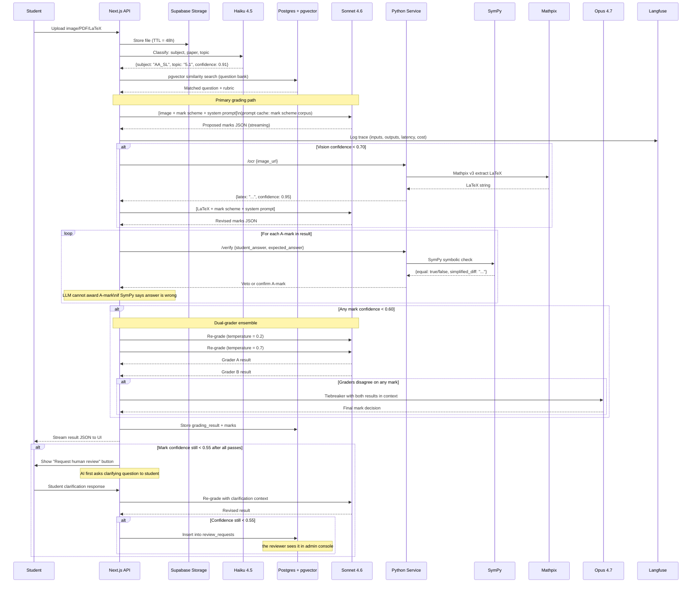

# Examina — Technical Roadmap
**Version:** 1.0  
**Last updated:** 2026-05-30  
**Status:** Pending Ada approval before Phase 2 begins

---

## 1. System Architecture

```mermaid
graph TD
    subgraph Client Layer
        WEB[Next.js 15 PWA\nWeb + Mobile]
        TG[Telegram Bot\n@ExaminaBot]
    end

    subgraph Edge
        CF[Cloudflare\nDDoS + WAF + CDN]
    end

    subgraph Frontend Hosting
        VCL[Vercel\nNext.js App Router]
    end

    subgraph API Layer - Next.js Routes
        AUTH[/api/auth]
        UPLOAD[/api/upload]
        GRADE[/api/grade]
        PRACTICE[/api/practice]
        STRIPE[/api/stripe]
        TGWH[/api/telegram]
        ADMIN[/api/admin]
    end

    subgraph Python Service - Railway
        SYMP[SymPy Verifier\n/verify]
        MANIM[Manim Renderer\n/render]
        OCR[Mathpix Proxy\n/ocr]
    end

    subgraph AI Layer
        H45[Haiku 4.5\nClassification]
        S46[Sonnet 4.6\nPrimary Grading]
        O47[Opus 4.7\nHL Tiebreaker]
    end

    subgraph Data Layer - Supabase EU
        PG[(PostgreSQL\n+ pgvector)]
        STOR[Storage\nUploads TTL 48h]
        SBAUTH[Supabase Auth]
    end

    subgraph External Services
        ELABS[ElevenLabs\nTTS]
        MXPX[Mathpix v3\nOCR Fallback]
        STRIPE_EXT[Stripe\n+ Stripe Tax]
        RESEND[Resend\nTransactional Email]
    end

    subgraph Observability
        SENTRY[Sentry\nErrors]
        LF[Langfuse\nLLM Traces]
        PH[PostHog EU\nProduct Analytics]
    end

    WEB --> CF
    TG --> CF
    CF --> VCL
    VCL --> AUTH & UPLOAD & GRADE & PRACTICE & STRIPE & TGWH & ADMIN
    GRADE --> H45 & S46 & O47
    GRADE --> SYMP
    GRADE --> OCR
    GRADE --> MANIM
    OCR --> MXPX
    MANIM --> ELABS
    MANIM --> STOR
    AUTH --> SBAUTH
    UPLOAD --> STOR
    GRADE --> PG
    PRACTICE --> PG & S46
    STRIPE --> STRIPE_EXT
    AUTH --> RESEND
    GRADE --> LF & SENTRY
    VCL --> PH
```

---

## 2. Database Schema

```sql
-- ============================================================
-- EXTENSIONS
-- ============================================================
create extension if not exists "vector";
create extension if not exists "pg_cron";

-- ============================================================
-- USERS (extends Supabase auth.users)
-- ============================================================
create table public.profiles (
  id              uuid primary key references auth.users(id) on delete cascade,
  display_name    text,
  email           text unique not null,
  age_verified    boolean not null default false,       -- 16+ checkbox confirmed
  tier            text not null default 'free'          -- 'free' | 'pro' | 'tutor'
                  check (tier in ('free','pro','tutor')),
  preferred_lang  text not null default 'tr',           -- 'tr' | 'en'
  timezone        text not null default 'Europe/Amsterdam',
  created_at      timestamptz not null default now(),
  updated_at      timestamptz not null default now()
);

-- ============================================================
-- SUBSCRIPTIONS (Stripe state mirror)
-- ============================================================
create table public.subscriptions (
  id                  uuid primary key default gen_random_uuid(),
  user_id             uuid not null references public.profiles(id) on delete cascade,
  stripe_customer_id  text unique,
  stripe_sub_id       text unique,
  status              text not null default 'inactive',  -- 'active' | 'inactive' | 'past_due' | 'canceled'
  plan                text,                              -- 'pro_monthly' | 'pro_annual'
  currency            text not null default 'eur',       -- 'eur' | 'usd' | 'try'
  current_period_end  timestamptz,
  cancel_at_period_end boolean not null default false,
  created_at          timestamptz not null default now(),
  updated_at          timestamptz not null default now()
);

-- ============================================================
-- IB SYLLABUS TREE
-- ============================================================
create table public.topics (
  id          uuid primary key default gen_random_uuid(),
  code        text unique not null,  -- e.g. 'AA-SL-5.1', 'AA-HL-5.11'
  subject     text not null          -- 'AA_SL' | 'AA_HL'
              check (subject in ('AA_SL','AA_HL')),
  paper       text not null          -- 'P1' | 'P2' | 'BOTH'
              check (paper in ('P1','P2','BOTH')),
  strand      text not null,         -- e.g. 'Calculus', 'Algebra', 'Statistics'
  title       text not null,
  parent_id   uuid references public.topics(id),
  sort_order  int not null default 0
);

-- ============================================================
-- QUESTION BANK (original IB-style, authored/validated by the reviewer)
-- ============================================================
create table public.questions (
  id              uuid primary key default gen_random_uuid(),
  topic_id        uuid not null references public.topics(id),
  subject         text not null check (subject in ('AA_SL','AA_HL')),
  paper           text not null check (paper in ('P1','P2')),
  difficulty      int not null check (difficulty between 1 and 5),
  total_marks     int not null,
  stem_text       text not null,      -- question text (LaTeX-aware markdown)
  stem_image_url  text,               -- optional diagram
  template_id     uuid,               -- NULL for fixed; set when parameterized (Phase 4)
  parameters      jsonb,              -- numeric variants for parameterized questions (Phase 4)
  embedding       vector(1536),       -- pgvector embedding for similarity search
  validated_by    text,               -- 'reviewer' | 'human_reviewer_id'
  validated_at    timestamptz,
  is_benchmark    boolean not null default false,  -- part of the 200-question gold set
  created_at      timestamptz not null default now()
);

-- ============================================================
-- RUBRICS (marking schemes, authored independently — not IBO materials)
-- ============================================================
create table public.rubrics (
  id          uuid primary key default gen_random_uuid(),
  question_id uuid not null references public.questions(id) on delete cascade,
  version     int not null default 1,
  marks       jsonb not null,
  -- Structure: [{ "mark_id": "M1", "type": "M"|"A"|"R", "description": "...",
  --              "correct_answer": "...", "follow_through": bool, "bod": bool }]
  notes       text,
  authored_by text not null,     -- 'reviewer' | reviewer id
  created_at  timestamptz not null default now(),
  unique (question_id, version)
);

-- ============================================================
-- SUBMISSIONS (student uploads)
-- ============================================================
create table public.submissions (
  id              uuid primary key default gen_random_uuid(),
  user_id         uuid not null references public.profiles(id) on delete cascade,
  question_id     uuid references public.questions(id),   -- NULL if unmatched
  subject         text check (subject in ('AA_SL','AA_HL')),
  paper           text check (paper in ('P1','P2')),
  input_type      text not null check (input_type in ('image','pdf','latex','text')),
  storage_path    text not null,      -- Supabase storage path
  storage_ttl     timestamptz not null default (now() + interval '48 hours'),
  ocr_used        boolean not null default false,
  ocr_latex       text,               -- extracted LaTeX if OCR was invoked
  status          text not null default 'pending'
                  check (status in ('pending','grading','graded','failed')),
  created_at      timestamptz not null default now()
);

-- Auto-delete storage after TTL (handled by pg_cron + Supabase Edge Function)
-- Grading result JSON is retained; only raw upload file is deleted.

-- ============================================================
-- GRADING RESULTS
-- ============================================================
create table public.grading_results (
  id                  uuid primary key default gen_random_uuid(),
  submission_id       uuid not null unique references public.submissions(id) on delete cascade,
  rubric_id           uuid references public.rubrics(id),
  total_available     int not null,
  total_awarded       int not null,
  overall_confidence  numeric(4,3) not null check (overall_confidence between 0 and 1),
  grader_model        text not null,   -- 'sonnet-4-6' | 'opus-4-7'
  grader_version      text not null,   -- grading prompt version, e.g. 'v1.2'
  dual_grader_used    boolean not null default false,
  tiebreaker_used     boolean not null default false,
  sympy_verified      boolean not null default false,
  langfuse_trace_id   text,
  raw_llm_output      jsonb,           -- full LLM response, for debugging
  created_at          timestamptz not null default now()
);

-- ============================================================
-- MARKS (individual mark decisions within a result)
-- ============================================================
create table public.marks (
  id              uuid primary key default gen_random_uuid(),
  result_id       uuid not null references public.grading_results(id) on delete cascade,
  mark_id         text not null,   -- e.g. 'M1', 'A1', 'R1'
  mark_type       text not null check (mark_type in ('M','A','R')),
  awarded         boolean not null,
  confidence      numeric(4,3) not null check (confidence between 0 and 1),
  rationale       text not null,
  student_excerpt text,            -- quoted from student's work
  follow_through  boolean not null default false,
  bod_applied     boolean not null default false,
  sympy_checked   boolean not null default false,
  sympy_result    text,            -- 'agree' | 'disagree' | 'not_applicable'
  sort_order      int not null default 0
);

-- ============================================================
-- HUMAN REVIEW QUEUE
-- ============================================================
create table public.review_requests (
  id              uuid primary key default gen_random_uuid(),
  result_id       uuid not null references public.grading_results(id) on delete cascade,
  mark_id         uuid references public.marks(id),   -- NULL = review entire submission
  trigger         text not null
                  check (trigger in ('student_request','low_confidence','ai_clarification_failed')),
  clarification_question  text,    -- what the AI asked the student
  student_clarification   text,    -- student's response
  status          text not null default 'pending'
                  check (status in ('pending','assigned','resolved')),
  assigned_to     text,            -- reviewer identifier (e.g. 'reviewer')
  reviewer_verdict  jsonb,         -- override decisions per mark
  reviewer_notes  text,
  resolved_at     timestamptz,
  created_at      timestamptz not null default now()
);

-- ============================================================
-- PRACTICE TESTS
-- ============================================================
create table public.practice_tests (
  id          uuid primary key default gen_random_uuid(),
  user_id     uuid not null references public.profiles(id) on delete cascade,
  topic_ids   uuid[] not null,
  subject     text not null check (subject in ('AA_SL','AA_HL')),
  paper       text not null check (paper in ('P1','P2')),
  questions   jsonb not null,   -- generated question content
  created_at  timestamptz not null default now()
);

-- ============================================================
-- VIDEO CACHE (Manim + ElevenLabs, cached by question+step)
-- ============================================================
create table public.video_cache (
  id              uuid primary key default gen_random_uuid(),
  question_id     uuid not null references public.questions(id) on delete cascade,
  language        text not null default 'tr' check (language in ('tr','en')),
  storage_path    text not null,   -- path in Supabase storage
  duration_secs   int,
  generation_cost numeric(8,4),    -- ElevenLabs + compute cost in EUR
  created_at      timestamptz not null default now(),
  unique (question_id, language)
);

-- ============================================================
-- BENCHMARK / EVAL RESULTS (public benchmark page data)
-- ============================================================
create table public.benchmark_runs (
  id                  uuid primary key default gen_random_uuid(),
  run_date            date not null,
  grader_version      text not null,
  total_questions     int not null,
  mark_agreement_rate numeric(5,4) not null,   -- e.g. 0.8742 = 87.42%
  false_positive_rate numeric(5,4) not null,   -- correct answer marked wrong
  false_negative_rate numeric(5,4) not null,   -- wrong answer marked correct
  per_topic_breakdown jsonb,
  is_published        boolean not null default false,
  created_at          timestamptz not null default now()
);

-- ============================================================
-- USAGE COUNTERS (free tier rate limiting)
-- ============================================================
create table public.usage_counters (
  user_id         uuid primary key references public.profiles(id) on delete cascade,
  graded_this_month   int not null default 0,
  practice_today      int not null default 0,
  month_reset_at      date not null default date_trunc('month', now())::date,
  day_reset_at        date not null default current_date
);

-- ============================================================
-- ROW-LEVEL SECURITY (applied to every table)
-- ============================================================
alter table public.profiles          enable row level security;
alter table public.subscriptions     enable row level security;
alter table public.submissions       enable row level security;
alter table public.grading_results   enable row level security;
alter table public.marks             enable row level security;
alter table public.review_requests   enable row level security;
alter table public.practice_tests    enable row level security;
alter table public.video_cache       enable row level security;
alter table public.usage_counters    enable row level security;

-- Users can only read/write their own rows
create policy "users_own_profile"       on public.profiles       for all using (auth.uid() = id);
create policy "users_own_subscriptions" on public.subscriptions  for all using (auth.uid() = user_id);
create policy "users_own_submissions"   on public.submissions    for all using (auth.uid() = user_id);
create policy "users_own_results"       on public.grading_results
  for select using (
    exists (select 1 from public.submissions s where s.id = submission_id and s.user_id = auth.uid())
  );
create policy "users_own_marks"         on public.marks
  for select using (
    exists (
      select 1 from public.grading_results r
      join public.submissions s on s.id = r.submission_id
      where r.id = result_id and s.user_id = auth.uid()
    )
  );
create policy "users_own_practice"      on public.practice_tests for all using (auth.uid() = user_id);
create policy "users_own_usage"         on public.usage_counters  for all using (auth.uid() = user_id);

-- Questions, topics, rubrics, video_cache: public read, admin write
create policy "public_read_questions"   on public.questions    for select using (true);
create policy "public_read_topics"      on public.topics       for select using (true);
create policy "public_read_rubrics"     on public.rubrics      for select using (true);
create policy "public_read_video_cache" on public.video_cache  for select using (true);

-- benchmark_runs: published rows are public
create policy "public_read_benchmarks"  on public.benchmark_runs
  for select using (is_published = true);

-- ============================================================
-- INDEXES
-- ============================================================
create index on public.questions using ivfflat (embedding vector_cosine_ops) with (lists = 100);
create index on public.submissions (user_id, created_at desc);
create index on public.marks (result_id, sort_order);
create index on public.review_requests (status, created_at);
create index on public.usage_counters (user_id);
```

---

## 3. Grading Pipeline — Sequence Diagram



---

## 4. Eval Methodology — Public Benchmark

### The Gold Set
- **200 original IB-style questions** authored and validated by the reviewer, spanning AA SL and AA HL across all syllabus strands, Papers 1 and 2.
- Each question has a hand-authored mark scheme (not IBO materials) and a gold-standard marking of 3 representative student responses per question (poor, partial, correct) = 600 marked submissions total.
- This set is sealed — never used in grading prompt development or fine-tuning.

### Metrics
| Metric | Definition | Target |
|---|---|---|
| Mark agreement rate | % of individual marks where AI and gold agree | ≥ 85% |
| False positive rate | % of incorrect answers AI awards an A-mark | < 5% |
| False negative rate | % of correct answers AI withholds an A-mark | < 10% |
| Method mark accuracy | Agreement on M-marks specifically | ≥ 88% |
| Confidence calibration | Brier score on per-mark confidence | < 0.15 |

### Process
1. GitHub Actions runs the eval suite nightly against the sealed gold set.
2. Results written to `benchmark_runs` table.
3. When `mark_agreement_rate ≥ 0.85` on two consecutive nightly runs, the row is published (`is_published = true`).
4. The public benchmark page (`/benchmark`) reads only published rows.
5. Every grading prompt change increments the `grader_version` field — benchmark history shows trajectory, not just the current number.

### What "agreement" means
We compare at the **mark level** (each M1, A1, R1 individually), not the total score. A result where AI gives 4/6 and gold gives 5/6 for the same reason is a partial disagreement, not a binary fail. This is the methodology we publish.

---

## 5. Twelve-Week Build Plan

```
WEEK  PHASE       MILESTONE
────  ──────────  ─────────────────────────────────────────────────────────────────
  1   Phase 2     Repo created. Next.js 15 scaffold + Tailwind + shadcn/ui.
                  Supabase project (EU region) — schema applied, RLS on.
                  Python FastAPI stub on Railway (health endpoint only).
                  GitHub Actions CI: lint + type-check + test on every PR.
                  Sentry + Langfuse keys wired. Vercel preview deploy live.
                  Domain registered (examina.ai or examina.io).

  2   Phase 2     "Hello grading" end-to-end:
                  hardcoded image → Next.js API → Sonnet 4.6 → hardcoded mark JSON
                  → displayed in UI. Proves the full request path works.
                  Cloudflare DNS set up. Staging URL shared with Ada.

  3   Phase 3     Grading prompt v1 written and documented in GRADING_PROMPT.md.
                  10 seed questions + rubrics loaded (the reviewer delivers these).
                  Real image → classification (Haiku) → question match (pgvector)
                  → Sonnet grading → structured JSON output.

  4   Phase 3     SymPy verification layer live.
                  Dual-grader ensemble live.
                  Opus tiebreaker live.
                  Mathpix OCR fallback live.
                  Prompt caching confirmed active (Langfuse shows cache hits).
                  First real student solution graded end-to-end. Ada reviews output.
                  Iterate grading prompt until output feels right.

  5   Phase 3     Grading prompt v1.x stable.
                  Per-mark confidence scores calibrated against 10-question dev set.
                  Student clarification flow live (AI asks question before escalation).
                  Human review queue writes to DB. Admin console stub shows queue.
                  Regression tests: 10-question suite, Pytest + Vitest, run in CI.

  6   Phase 4     Upload UI: drag-drop web, camera capture mobile PWA.
                  Result UI: annotated marks, total score, per-mark rationale + confidence.
                  "Request human review" button wired to review queue.
                  Streaming: marks appear progressively as they grade.

  7   Phase 4     Auth: Supabase email + Google OAuth.
                  Age gate (16+ checkbox) on signup.
                  Free tier rate limits enforced (5 graded papers/month, 3 practice tests/day).
                  Stripe: Pro monthly + annual products created. Checkout + webhook handler.
                  Stripe Tax enabled for EU VAT.

  8   Phase 4     Telegram bot: photo → grading → result message.
                  Bot registered as @ExaminaBot (or chosen handle).
                  Admin review console: the reviewer logs in, sees queue, can override marks.
                  Overrides saved to DB as eval data.

  9   Phase 4     Practice test generator: topic-conditioned, AA SL + HL,
                  MCQ + short-answer, original questions, free tier hook.
                  Manim video rendering pipeline: Python service generates MP4,
                  caches in Supabase storage by question + language.
                  ElevenLabs TTS integration (Turkish voice first).

 10   Phase 4     "Explain this" button live end-to-end.
                  Video generation p95 < 60s confirmed (load test with k6).
                  Grading p95 < 20s confirmed.
                  Resend transactional emails: signup, grading ready, review resolved.
                  PostHog funnels set up: signup → first grade → paywall → Pro.

 11   Phase 5     Eval harness: 200-question gold set loaded (the reviewer delivers).
                  Nightly eval GitHub Actions job runs.
                  Benchmark page (/benchmark) live with real numbers.
                  First publish when agreement rate ≥ 85%.

 12   Phase 6     Beta: 50 students from Ada's network.
                  Sentry alert triage.
                  Grading regression tests expanded with beta failures.
                  No new features — only fix what breaks.
                  Go/no-go review with Ada before opening to public waitlist.
```

---

## 6. Cost Model

### Per-Submission Cost Breakdown (average)

| Component | Calculation | Cost |
|---|---|---|
| Sonnet 4.6 primary grading (with prompt caching) | ~8K tokens in (80% cached @ $0.30/M, 20% uncached @ $3/M) + 2K out @ $15/M | ~$0.0036 |
| Mathpix OCR fallback (20% of submissions) | 0.20 × $0.004 | ~$0.0008 |
| Opus 4.7 tiebreaker (10% of submissions) | 0.10 × (6K in @ $15/M + 1.5K out @ $75/M) | ~$0.020 |
| Haiku 4.5 classification | ~500 tokens @ $0.25/M in | ~$0.0001 |
| ElevenLabs TTS (30% click "Explain", ~800 chars) | 0.30 × $0.30/1K chars × 0.8 | ~$0.0072 |
| Manim render compute (Railway, ~15s CPU) | ~$0.0010 |
| Supabase storage + egress | ~$0.0005 |
| **Total per submission** | | **~$0.033** |

### Monthly Infrastructure Cost by Scale

| Scale | Submissions/mo | API + AI | Supabase | Vercel | Railway | Tools* | **Total** | Revenue (€9.99 avg) | Margin |
|---|---|---|---|---|---|---|---|---|---|
| **500 paying users** | 10,000 | $330 | $25 | $20 | $50 | $100 | **~$525 / ~€490** | ~€5,000 | 90% |
| **1,000 paying users** | 20,000 | $660 | $25 | $20 | $80 | $100 | **~$885 / ~€820** | ~€10,000 | 92% |
| **10,000 paying users** | 200,000 | $6,600 | $100 | $150 | $300 | $200 | **~$7,350 / ~€6,800** | ~€100,000 | 93% |
| **100,000 paying users** | 2,000,000 | $66,000 | $500 | $500 | $1,500 | $500 | **~$69,000 / ~€64,000** | ~€1,000,000 | 94% |

*Tools = Sentry + Langfuse + PostHog + Resend (all have generous free tiers at lower scales)

**Launch success criterion check:** At 500 paying users, total cost ~€490/month — well under the €1,500 target. ✓

**Note on Opus 4.7 cost:** At 100K users, Opus tiebreaker is the dominant cost. If tiebreaker rate stays at 10%, this is fine. If it drifts higher (meaning the grading prompt is underperforming), we optimize the prompt before scaling. The eval suite catches this early.

### Free Tier Cost Impact
Free users (5 graded papers/month, 3 practice tests/day):
- 5 submissions × $0.033 = $0.165/month per free user
- At 10:1 free-to-paid ratio with 1,000 paying users = 10,000 free users = $1,650/month
- Covered comfortably by Pro revenue

---

## 7. Architectural Decision Log

See `docs/DECISIONS.md` for the full ADR log. Summary of key decisions made during roadmap:

| Decision | Choice | Reason |
|---|---|---|
| LLM proposes, SymPy vetoes A-marks | Hybrid symbolic+LLM | LLM confidently wrong on arithmetic is a fatal product defect |
| Prompt caching on mark scheme corpus | Anthropic cache | Mark scheme is static per topic; caching cuts cost 80% on cached tokens |
| Dual-grader with Opus tiebreaker | Ensemble at low confidence | Single LLM on ambiguous cases is worse than asking twice |
| Student clarification before human escalation | AI asks first | Keeps the reviewer's queue lean; student context often resolves ambiguity |
| Fixed questions Phase 3, parameterized Phase 4 | Incremental | Speed to first working product > perfect architecture on day one |
| Supabase EU region only | Data residency | GDPR + KVKK compliance; student data never leaves EU |
| 48h upload TTL, indefinite result JSON | Asymmetric retention | Raw handwriting images are sensitive; structured marks are product value |
| pgvector in Supabase (not separate Pinecone) | Fewer moving parts | Embedding search volume doesn't justify a separate vector DB at MVP scale |

---

*This document is the single source of truth for Examina's technical architecture through v1 launch. Update it when architecture changes, not after.*
